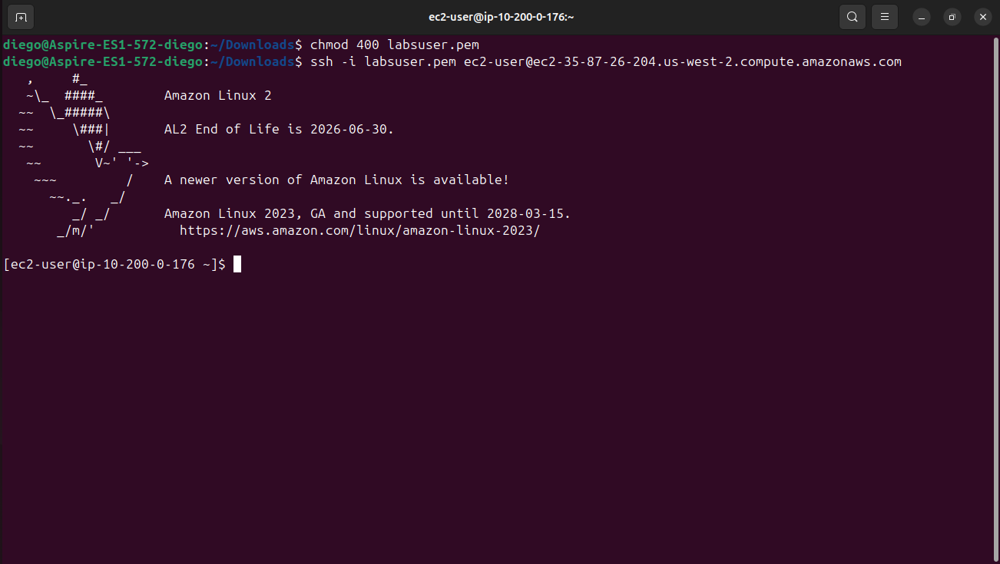
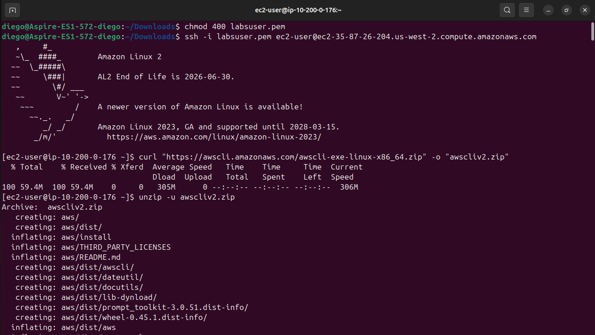
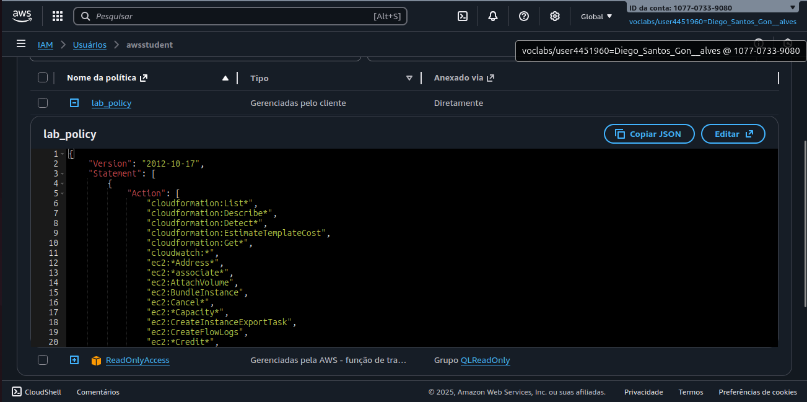
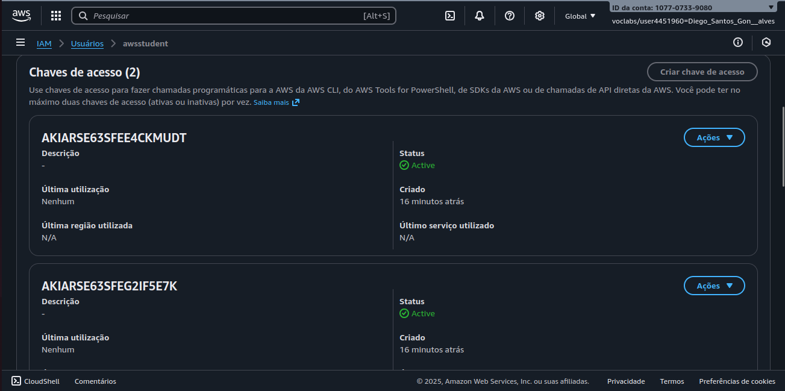
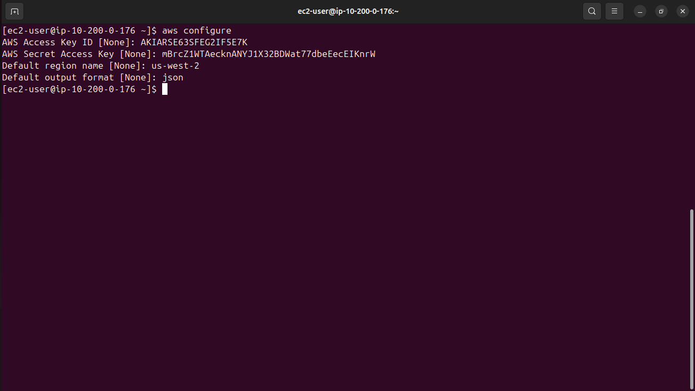
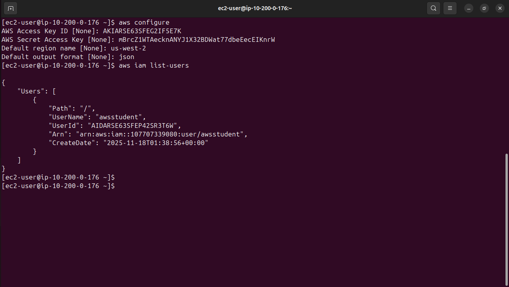
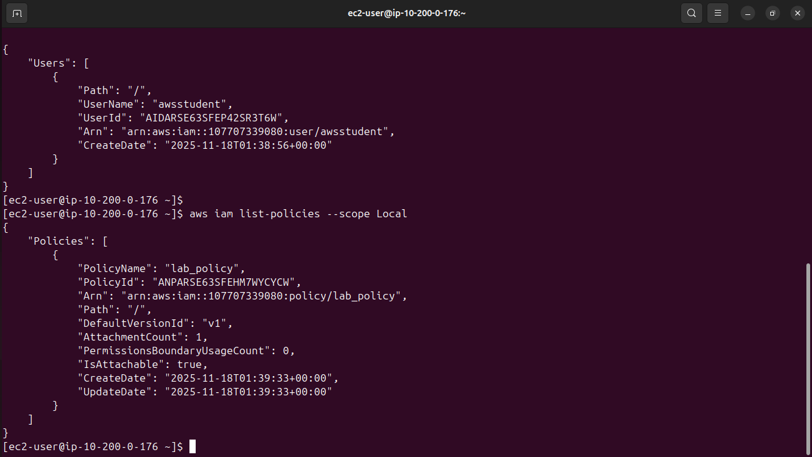
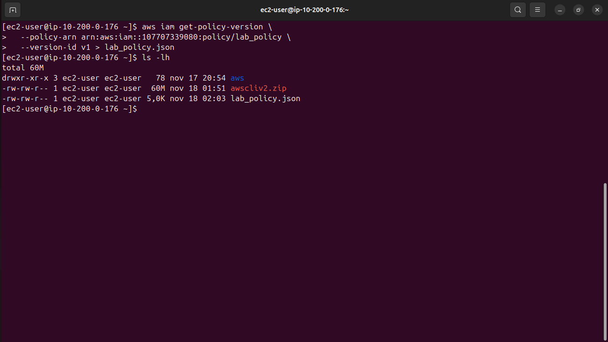
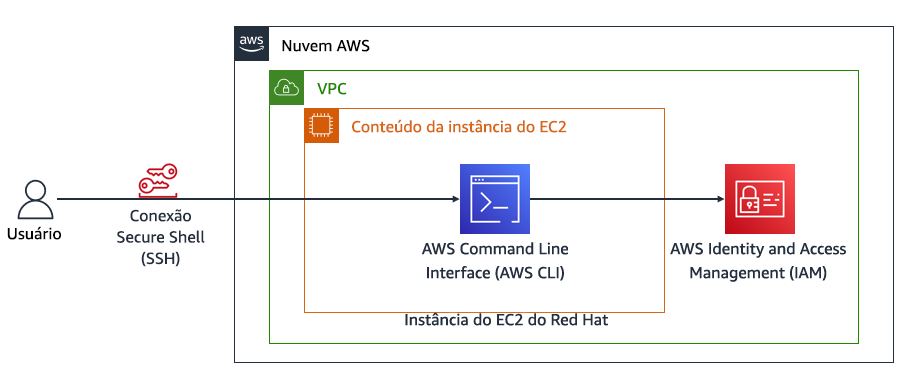

# 👨‍💻 Documentação: Instalação e Configuração da AWS CLI em Instância EC2 (Red Hat)

Este repositório reúne minha documentação prática sobre a instalação, configuração e utilização da **AWS CLI** em uma instância EC2 Linux (Red Hat), como parte das atividades do **AWS re/Start – Escola da Nuvem ☁️**.

---

## 🧠 Habilidades Adquiridas

* Conexão segura com uma instância EC2 via SSH
* Instalação manual da AWS CLI em ambiente Red Hat
* Configuração da CLI com Access Key e Secret Key
* Execução de comandos AWS CLI para interação com serviços da AWS
* Consulta e manipulação de políticas IAM via linha de comando
* Download de políticas IAM em formato JSON usando comandos avançados

---

## 🛠️ Tecnologias Utilizadas

<div align="left">

  
  
  
  
  
  

</div>

---

## 📁 Estrutura do Repositório

`aws-cli-redhat-lab/`

```
├── imagens/        # Capturas de tela organizadas por tarefa
├── lab_policy.json     # Política IAM baixada via AWS CLI (desafio)
└── README.md
```

---

## 🚀 Etapas Realizadas no Laboratório

---

# 1️⃣ Conexão via SSH com a instância EC2 (Red Hat)

### 🔑 Preparação da chave

```bash
chmod 400 labsuser.pem
```

### 🌐 Conexão SSH

```bash
ssh -i labsuser.pem ec2-user@<ip-publico-da-instancia>
```

#### 👨‍💻 Conexão bem-sucedida



---

# 2️⃣ Instalação da AWS CLI no Red Hat

A instância Red Hat não possui AWS CLI pré-instalada, então foi necessário instalar manualmente.

### 📥 Download do instalador

```bash
curl "https://awscli.amazonaws.com/awscli-exe-linux-x86_64.zip" -o "awscliv2.zip"
```

### 📦 Descompactando o instalador

```bash
unzip -u awscliv2.zip
```



### 🛠️ Executando a instalação

```bash
sudo ./aws/install
```

### ✔️ Verificando a instalação

```bash
aws --version
```


---

# 3️⃣ Verificando permissões e políticas no Console IAM

No Console da AWS:

* Acessar **IAM → Users → awsstudent**
* Verificar:

  * Políticas anexadas (lab_policy)
  

  
  * Credenciais de acesso (AccessKey e SecretKey)
  


* ◀️ Acessar a política em formato JSON pelo console para comparação posterior

---

# 4️⃣ Configuração da AWS CLI

```bash
aws configure
```

Preenchido com:



---

# 5️⃣ Testando o acesso IAM via AWS CLI

### Listar usuários IAM:

```bash
aws iam list-users
```

Retorna uma lista JSON contendo o usuário `awsstudent`.



---

# 🏆 Desafio: Baixar a Política IAM (lab_policy) via AWS CLI

### 1. Listar políticas do tipo Local

```bash
aws iam list-policies --scope Local
```



### 2. Identificar:

* `Arn` da política `lab_policy`
* `DefaultVersionId`

### 3. Baixar a versão da política:

```bash
aws iam get-policy-version \
  --policy-arn arn:aws:iam::<ID-DA-CONTA>:policy/lab_policy \
  --version-id v1 > lab_policy.json
```

⬇️ Arquivo `lab_policy.json` salvo no repositório.



---

## 🏗️ Considerações Finais da Arquitetura

O laboratório utilizou uma **instância Amazon EC2 (Red Hat)** dentro de uma **VPC**, acessada por **SSH**, onde a **AWS CLI** foi instalada e configurada com um usuário IAM criado exclusivamente para o exercício.  
Esse ambiente permitiu validar o uso da CLI, aplicar políticas de laboratório e entender, na prática, como permissões impactam os comandos executados na AWS.



---

# 📌 Resumo do Laboratório

* Instalei e configurei a AWS CLI manualmente em uma instância Red Hat
* Estabeleci conexão segura via SSH
* Consultei políticas IAM pelo console e pela CLI
* Usei comandos avançados para download de políticas IAM
* Entendi na prática a diferença entre acesso via Console e via CLI

---

⚠️ ***Observação***

Este laboratório foi realizado em um **ambiente sandbox da AWS**, disponibilizado apenas para fins educacionais. Nesse tipo de ambiente, o acesso é temporário e os **recursos são automaticamente encerrados e excluídos ao final da sessão**.

Informações como **Account ID, Chaves de acesso ou nome do usuário do laboratório podem aparecer nos prints**, mas **não representam risco de segurança**, pois não pertencem a uma conta real e não permitem qualquer acesso externo.
